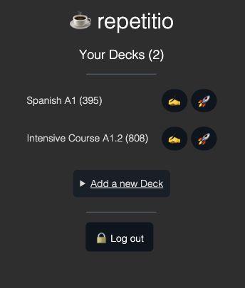

# repetitio

## what is it

- card learning app inspired by Anki
- uses the SM2 algorithm: https://www.npmjs.com/package/supermemo

### SM2 Quick Reference

#### Item

- interval: inter-repetition interval after the repetitions (in days). Init: 0.
- repetition: the number of continous correct responses. Init: 0.
- efactor: the easiness of memorizing and retaining a given item in memory. Init: 2.5.

#### Grades

5: perfect response.
4: correct response after a hesitation.
3: correct response recalled with serious difficulty.
2: incorrect response; where the correct one seemed easy to recall.
1: incorrect response; the correct one remembered.
0: complete blackout.

## use

- git clone <this repo>
- you'll need to install meteor: https://www.meteor.com/developers/install
- then run `meteor npm i`
- then `npm run dev` to develop
- the prodution command is the regular `npm start`
